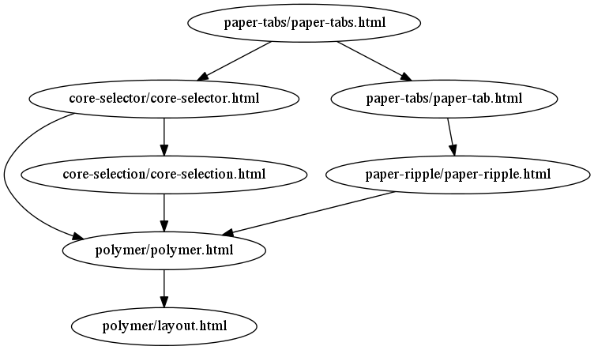

polymer-strands
===============

A tool to understand the dependencies of web components.

`polymer-strands` can read an HTML file and then list out all of the
[imports][HTMLImports] in it, as well as the dependencies of those
imports.

If you want to want to concatenate all of your web component files
together, see [Vulcanize][].

Installation
------------

`polymer-strands` is built using [Go][], so you will obviously need
that installed. From there, it's just a simple get and it should be in
your `GOPATH`.

    go get github.com/pope/polymer-strands

### TODO

- Create pre-built binaries of polymer-strands.

Usage
-----

    Usage: ./polymer-strands [options] <filename>
        -dot=false: Print out in dot format

There are two output formats with `polymer-strands` -- a simple list
of pairs and a dot file containing a digraph of all of the
dependencies.

### List of pairs

Each line is a pair containing the a filename and a dependency within
that file.

    $ polymer-strands paper-tabs/paper-tabs.html
    paper-tabs/paper-tabs.html core-selector/core-selector.html
    paper-tabs/paper-tabs.html paper-tabs/paper-tab.html
    core-selector/core-selector.html polymer/polymer.html
    core-selector/core-selector.html core-selection/core-selection.html
    polymer/polymer.html polymer/layout.html
    core-selection/core-selection.html polymer/polymer.html
    paper-tabs/paper-tab.html paper-ripple/paper-ripple.html
    paper-ripple/paper-ripple.html polymer/polymer.html

This output can be piped into [tsort][] to topologically sort all of
the dependencies. This should the the order in which [Vulcanize][]
would concatenates the web components for that file.

    $ polymer-strands paper-tabs/paper-tabs.html | tsort
    paper-tabs/paper-tabs.html
    paper-tabs/paper-tab.html
    core-selector/core-selector.html
    paper-ripple/paper-ripple.html
    core-selection/core-selection.html
    polymer/polymer.html
    polymer/layout.html

### Dot

If [DOT][] is specified, then `polymer-strands` will print out the
dependencies as a digraph, which can easily be passed into the `dot`
command to print out a nice picture.

    $ polymer-strands -dot paper-tabs/paper-tabs.html \
        | dot -Tpng > paper-tabs-deps.png

### Component Modules

As mentioned before, [Vulcanize][] is great if you want to concatenate
all of your components together. But say your site is big enough where
the payload of bundling everything together may be too costly. What
you could do is use `polymer-strands` to find the components that are
required to show something to the user, and then lazy load the other
components as they are required. No need to load edit components for
your site if the user it just viewing content.

### TODO

- Support multiple filenames as input.
- Come up with a real-world example and mini tutorial for component
  modules.

[HTMLImports]: https://github.com/polymer/HTMLImports
[Go]: http://golang.org
[tsort]: https://www.gnu.org/software/coreutils/manual/html_node/tsort-invocation.html
[Vulcanize]: https://github.com/Polymer/vulcanize
[DOT]: http://en.wikipedia.org/wiki/DOT_(graph_description_language)
